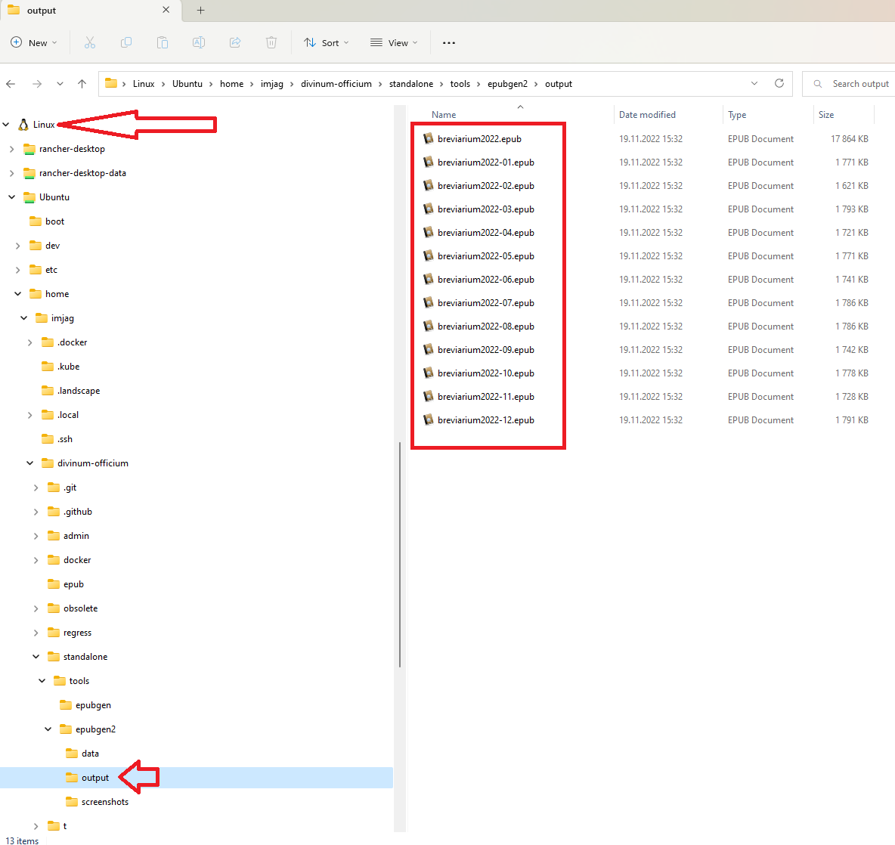

How to generate Divine Office files
===================================

Using docker (easier)
---------------------

1. Download (and unpack) the [whole DivinumOfficium repository](https://github.com/DivinumOfficium/divinum-officium/archive/refs/heads/master.zip).
2. Install docker for your operating system. (On Windows, you can use [Docker Desktop](https://www.docker.com/products/docker-desktop/) or [Rancher Desktop](https://rancherdesktop.io/) with dockerd routine.)
3. Open a terminal and navigate to the root folder of the DivinumOfficium files. Run the following command:  

   `docker-compose -f docker-compose-generator.yml run generator bash`
4. A shell should open. Execute the command to generate the breviary files (see the Examples section below), e.g.:

   `./epubgen2.sh`

You can find the resulting files in `the standalone\tools\epubgen2` folder.

Without docker
--------------

1. Start a linux shell.
   (On Windows, you can use Windows Subsystem for Linux (WSL):
   Run `wsl --install` from a terminal as an administrator to install WSL.
   Then restart your machine.
   You can then access a linux shell by running `wsl`.)

2. Install GIT and PERL and other prerequisities:

   `sudo apt-get update && sudo apt-get install -y git curl wget apache2 libcgi-session-perl bsdmainutils zip libwww-perl`
3. Clone the DivinumOfficium repository:

   `git clone https://github.com/DivinumOfficium/divinum-officium.git`
4. Navigate to the standalone folder within the repository:

   `cd divinum-officium/standalone/tools/epubgen2/`
5. Execute the command to generate the breviary files (see the Examples section below), e.g.:

   `./epubgen2.sh`

On Windows, you can easily access the resulting files from the Windows Explorer.


Examples
--------

### Using the 1960 rubrics for the current year

 `./epubgen2.sh`

### Using the 1960 rubrics for years 2023, 2024 and 2025

 `./epubgen2.sh -y 2023 -t 2025`

### Using the 'Divino Afflatu' rubrics for years 2023 and 2024

 `./epubgen2.sh -y 2023 -t 2024 -r DA`

Converting EPUB to MOBI
----------------

You can use [Kindlegen](https://archive.org/details/kindlegen2.9) to convert EPUB format to MOBI format.

Troubleshooting
----------------

### WSL cannot access network

Run the following commands on in a terminal on the host machine as an administrator:

 ```pwsh
 wsl --shutdown
 netsh winsock reset
 netsh int ip reset all
 netsh winhttp reset proxy
 ipconfig /flushdns
```

See [No internet connection on WSL Ubuntu](https://stackoverflow.com/questions/62314789/no-internet-connection-on-wsl-ubuntu-windows-subsystem-for-linux).
